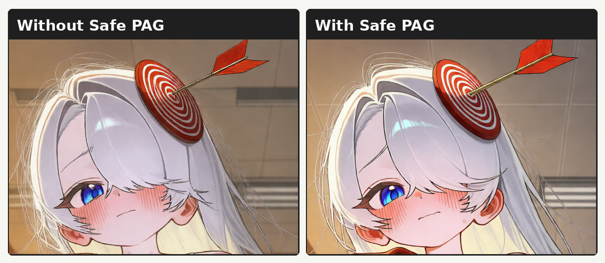

# Anima Safe PAG

[English README](README.md)

Anima Safe PAG는 Anima/Cosmos/Predict2 계열 DiT 모델에서 Perturbed Attention
Guidance(PAG)를 부드럽게 적용하는 ComfyUI 노드입니다.

선택한 self-attention 블록을 perturb해 weak prediction을 만들고, CFG 결과가 그
예측에서 멀어지는 방향으로 샘플을 보정합니다. 일반적인 hard PAG보다 부드럽게
동작하도록 `perturbation_strength`로 attention perturbation의 강도를 조절합니다.

cond, uncond, PAG 예측은 같은 `calc_cond_batch` pass 안에서 계산됩니다.
`start_percent` / `end_percent` 활성 구간 밖에서도 PAG row를 유지해 batch shape가
바뀌지 않습니다. 캐시, replay, sampler-side 최적화 노드가 들어간 워크플로우에서도
안정적으로 쓰기 좋습니다.

## 비교



## 설치

ComfyUI Manager:

```text
Manager -> Install Custom Nodes -> "Anima Safe PAG" 검색 -> Install
```

수동 설치:

```bash
cd ComfyUI/custom_nodes
git clone https://github.com/iljung1106/comfyui-anima-safe-pag.git
```

설치 후 ComfyUI를 재시작하세요.

## 권장 설정

```text
scale: 4.0
block_indices: 18
perturbation_strength: 0.75
head_indices:
start_percent: 0.0
end_percent: 0.7
rescale: 0.20
rescale_mode: full
```

28블록 Anima 체크포인트에서는 `14`보다 큰 block index부터 시도하는 것을
권장합니다. 뒤쪽 블록은 초반 블록보다 국소 구조, 선의 힘, 작은 디테일에
비교적 깔끔하게 작용합니다. 기본값 `18`은 균형 잡힌 시작점입니다. 가까운 값인
`16`, `18`, `20`, `18-20`도 함께 시험해 볼 만합니다.

## 파라미터

`scale`

PAG 보정 강도입니다. 값이 높을수록 perturbed prediction에서 더 강하게
멀어집니다. 선이 거칠어지거나 디테일이 깨지면 값을 낮추세요.

`block_indices`

self-attention을 perturb할 transformer block입니다. `18`, `18,20`, `18-20`처럼
단일 값, 쉼표 목록, 범위를 쓸 수 있습니다. 일반적인 28블록 Anima 체크포인트는
`14`보다 큰 값을 권장합니다.

`perturbation_strength`

normal self-attention과 value/identity path를 섞는 비율입니다. `0.0`은 attention을
바꾸지 않습니다. `1.0`은 hard PAG에 가장 가깝습니다. 기본값 `0.75`는 weak
prediction을 충분히 만들면서 perturbation이 지나치게 강해지는 것을 줄입니다.

`head_indices`

특정 attention head에만 perturbation을 적용하는 고급 옵션입니다. 일반적인
사용에서는 비워두세요. 흔한 2048채널 / 16-head Anima 체크포인트에서 head는
`0`부터 `15`까지지만, 직접 고르면 결과가 예측하기 어려워질 수 있습니다.

`start_percent` / `end_percent`

적용 구간을 raw sigma가 아니라 샘플링 진행률로 지정합니다. `0.0`은 샘플링 시작,
`1.0`은 마지막 스텝입니다. 기본값 `0.0`부터 `0.7`은 초반부터 중후반까지 Safe
PAG를 적용합니다.

`rescale`

PAG 보정 뒤 대비, 채도, 에너지가 과하게 커지는 것을 줄입니다. `0.0`이면
rescale을 쓰지 않습니다. 기본값 `0.20`은 약한 보정입니다.

`rescale_mode`

`full`은 Safe PAG guidance가 더해진 CFG 결과 전체를 기준으로 rescale합니다.
`partial`은 positive prediction에 Safe PAG guidance를 더한 값을 기준으로
rescale합니다. 기본값은 `full`입니다.

## 호환성

Anima Safe PAG는 `diffusion_model.blocks`와 block 내부
`self_attn.compute_attention`을 가진 Anima/Cosmos/Predict2 스타일 모델을
대상으로 합니다.

기존 `model_function_wrapper` 동작을 가능한 한 보존하고, 별도의 post-CFG 모델
호출을 쓰지 않습니다. Anima Layer Replay Patcher, SPEED처럼 안정적인 모델 실행
흐름에 의존하는 최적화 노드와 함께 쓰기 좋습니다.
